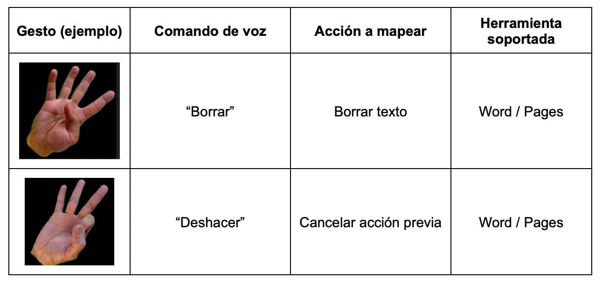
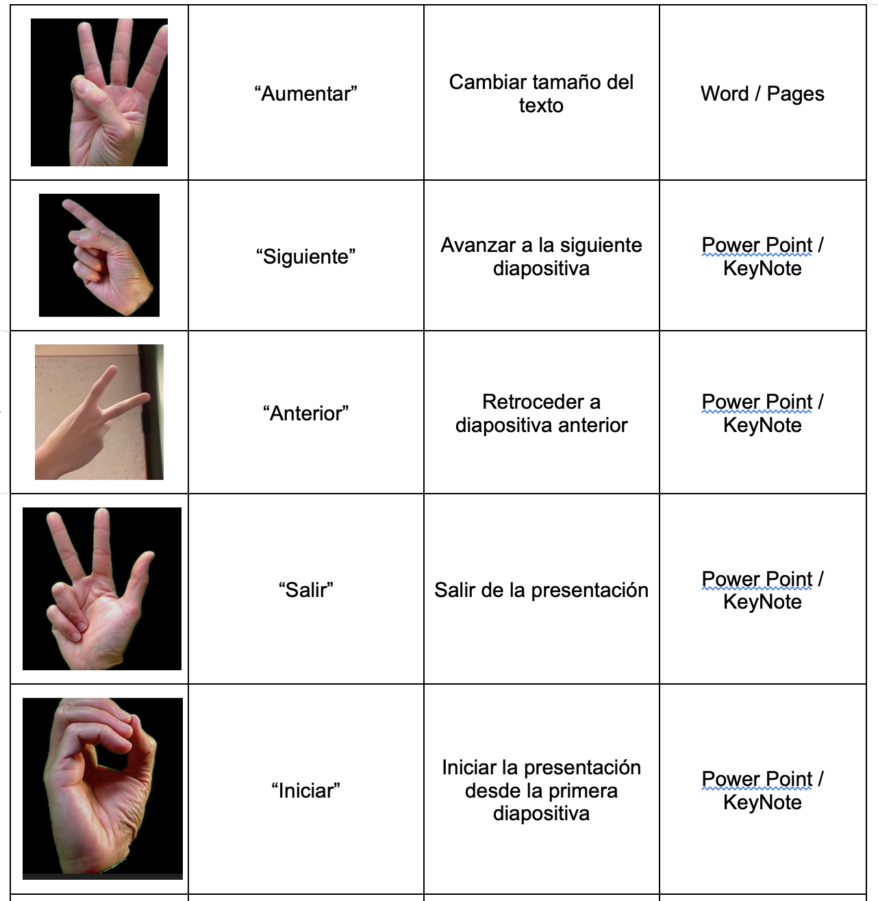
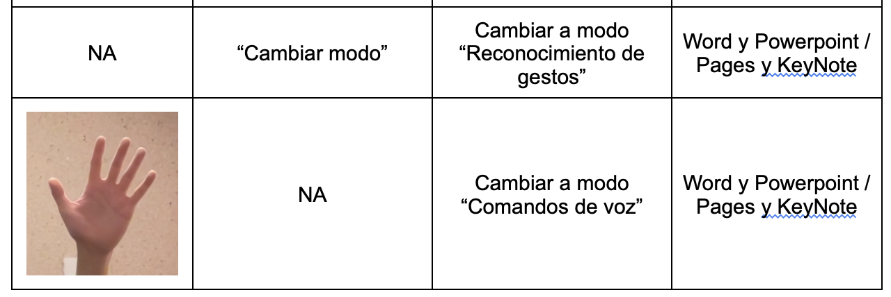
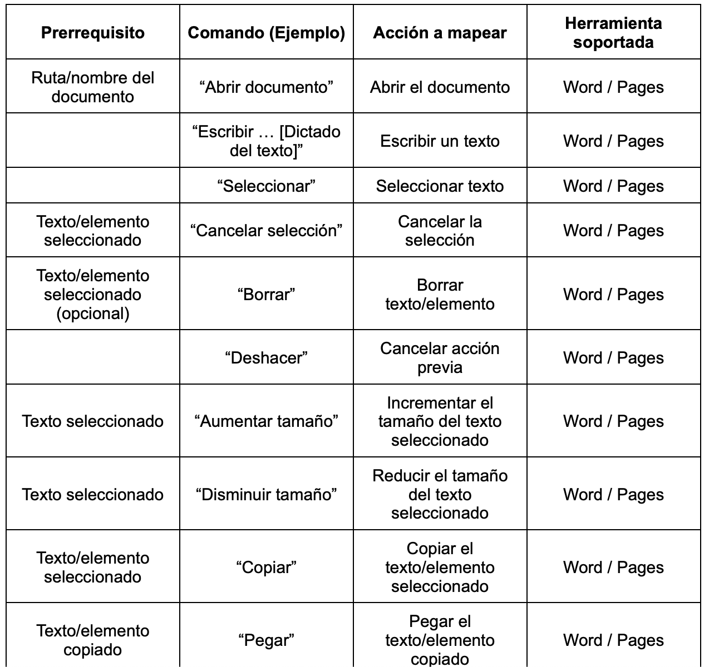
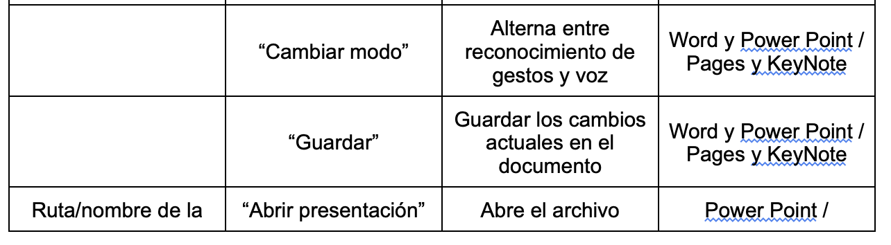
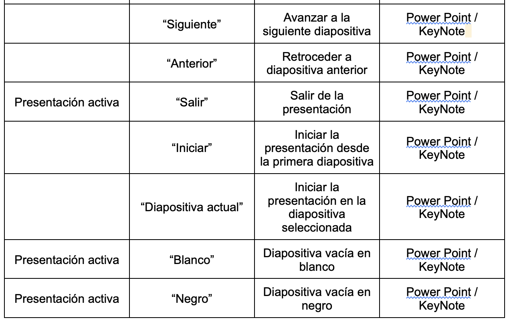

Interfaz Inteligente: Control a través de gestos y voz para Microsoft Office Word y Power Point 

---

El siguiente proyecto es la base de un Trabajo Final de Maestría, para la Maestría en Inteligencia Artificial de la UNIR México.
El principal objetivo de este trabajo es el desarrollo de un prototipo funcional que proporcione a usuarios la interacción con Word y Power Point a través de una Interfaz de Usuario Natural.

## Requisitos

1. Sistema Operativo: MacOS Ventura 13.0 o Windows 10/11
2. Python 3.9
3. PIP version 3
4. Permisos de acceso a micrófono, cámara y al sistema de archivos.


## Instalación

Para poder ejecutar adecuadamente el proyecto es necesario clonar el repositorio en su máquina local 

```
git clone https://github.com/smart-interface-13/smart-interface.git
cd smart-interface
```

Posteriormente se debe crear un entorno virtual e instalar los requerimientos de librerías de Python y ejecutar el flujo principal

```
python3 -m venv venv
source venv/bin/activate
pip3 install -r requirements.txt
python3 main_flow.py
```

## Comandos y gestos soportados

Para utilizar la siguiente herramienta, los siguientes comandos son aceptados tanto para sistema operativo Windows (con Word y PowerPoint) y en MacOS (con Page y KeyNote).





### Comandos de voz (adicionales) soportados






## Notas especiales

Siempre que el programa se ejecuta el modo default es con comando de voz, es necesario cambiar mediante comando al modo de reconocimiento gestual si se requiere.

**Ocasionalmente, sobre todo al ser ejecutado por primera vez, el sistema operativo puede solicitar permisos de acceso al micrófono, cámara y al sistema de archivos. Todos los permisos son requeridos para el funcionamiento correcto del software.**

## Condiciones del entorno físico

Para garantizar una óptima funcionalidad del proyecto, se requieren ciertas condiciones en el entorno físico:
1. Iluminación adecuada: Una iluminación insuficiente puede dificultar la detección de gestos y expresiones faciales por parte de la cámara web, lo que afectaría la precisión del reconocimiento.
2. Espacio libre: Se necesita un espacio despejado y suficiente para permitir movimientos gestuales sin obstrucciones. Un área de trabajo amplia y libre de obstáculos facilitará la interacción natural del usuario con la interfaz.
3. Posicionamiento de la cámara web y micrófono: La cámara web y el micrófono deben estar ubicados estratégicamente para capturar con precisión los gestos y comandos de voz del usuario. Se recomienda una posición elevada y centrada para la cámara web, y un micrófono con un alcance adecuado para captar la voz del usuario.
4. Condiciones acústicas: Un entorno con niveles de ruido controlados ayudará a mejorar la precisión del reconocimiento de voz. Reducir al mínimo los ruidos externos y reverberaciones contribuirá a una mejor interpretación de los comandos de voz.
5. Superficie de trabajo adecuada: Una superficie de trabajo plana y estable es esencial para evitar movimientos aleatorios que podrían causar ruido tanto acústico como visual.